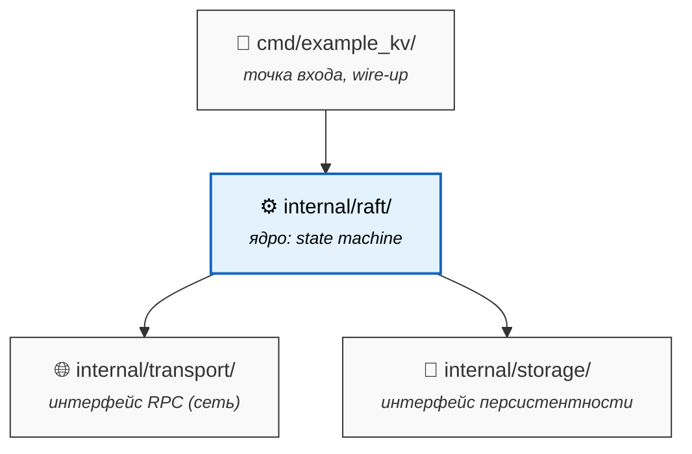

# Raft Consensus Algorithm

Учебная имплементация алгоритма консенсуса Raft на Go. Пишу для глубокого понимания принципов работы распределенных систем, обеспечения отказоустойчивости и сетевого взаимодействия на низком уровне.

## Архитектура
Проект логически разделен на ядро консенсуса и подключаемые слои (транспорт, хранилище):
* `internal/raft/` — стейт-машина (Leader, Follower, Candidate), обработка таймаутов выборов (Election) и хартбитов (Heartbeats).
* `internal/transport/` — слой межсервисного общения (обработка RPC `AppendEntries` и `RequestVote`).
* `internal/storage/` — персистентное хранилище состояния узла (терм, голос) и логов команд (Write-Ahead Log).

## Стек
* **Язык:** Go (1.22+)
* **Сеть:** gRPC / нативные TCP-сокеты (WIP)
* **Синхронизация:** каналы, select, мьютексы, atomic-операции.

## Текущий статус (WIP)
- [x] Разбор оригинальной пейперы (In Search of an Understandable Consensus Algorithm).
- [x] Проектирование архитектуры слоев (Транспорт, Лог, Стейт-машина).
- [ ] Имплементация механизма Leader Election (рандомизация таймаутов, подсчет голосов).
- [ ] Имплементация Log Replication (рассылка логов фолловерам, фиксация коммитов).
- [ ] Интеграция с подсистемой хранения (WAL).